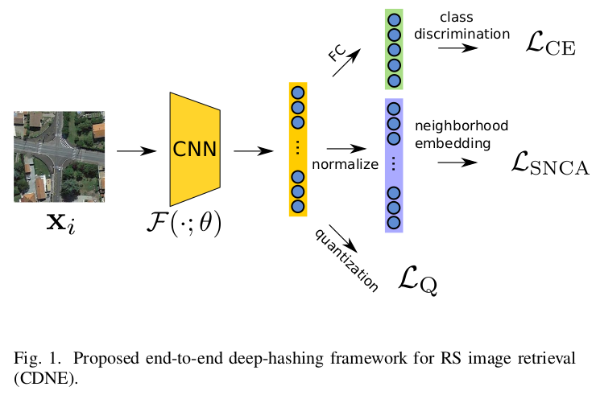
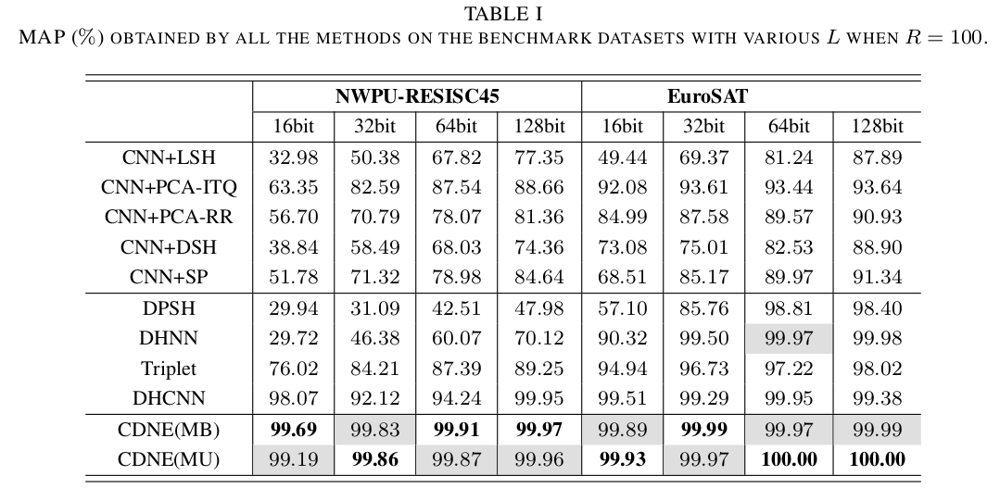

# Deep Hashing based on Class-Discriminated Neighborhood Embedding

[Jian Kang](https://github.com/jiankang1991), [Ruben Fernandez-Beltran](https://scholar.google.es/citations?user=pdzJmcQAAAAJ&hl=es), [Zhen Ye](https://scholar.google.com/citations?user=wftJB7QAAAAJ&hl=en), [Xiaohua Tong](https://scholar.google.com/citations?user=Kxn4zKEAAAAJ&hl=en), [Antonio Plaza](https://www.umbc.edu/rssipl/people/aplaza/).

---

This repo contains the codes for the JSTARS paper: [Deep Hashing based on Class-Discriminated Neighborhood Embedding](). we propose a new deep-hashing technique based on the class-discriminated neighborhood embedding (CDNE), which can properly capture the locality structures among the RS scenes and distinguish images class-wisely in the Hamming space. The proposed method achieves the state-of-the-art performance on RS image retrieval. An illustration of the proposed method is displayed as follows:


<p align="center">

</p>

<p align="center">

</p>

## Usage

`train/main.py` is the script of the proposed CDNE(MU) for training and validation.

`train_MB/main.py` is the script of the proposed CDNE(MB) for training and validation.

## Citation

```
@article{kang2020cdne,
  title={{Deep Hashing based on Class-Discriminated Neighborhood Embedding}},
  author={Kang, Jian and Fernandez-Beltran, Ruben and Ye, Zhen and Tong, Xiaohua and Plaza, Antonio},
  journal={IEEE Journal of Selected Topics in Applied Earth Observations and Remote Sensing},
  year={2020},
  note={DOI:10.1109/JSTARS.2020.3027954}
  publisher={IEEE}
}
```

## References

[1] Wu, Zhirong, Alexei A. Efros, and Stella X. Yu. "Improving generalization via scalable neighborhood component analysis." Proceedings of the European Conference on Computer Vision (ECCV). 2018.

[2] He, Kaiming, et al. "Momentum contrast for unsupervised visual representation learning." arXiv preprint arXiv:1911.05722 (2019).

[3] Kang, J., Fernandez-Beltran, R., Ye, Z., Tong, X., Ghamisi, P., & Plaza, A. (2020). Deep Metric Learning Based on Scalable Neighborhood Components for Remote Sensing Scene Characterization. IEEE Transactions on Geoscience and Remote Sensing.

[4] Tian, Yonglong, Dilip Krishnan, and Phillip Isola. "Contrastive multiview coding." arXiv preprint arXiv:1906.05849 (2019).